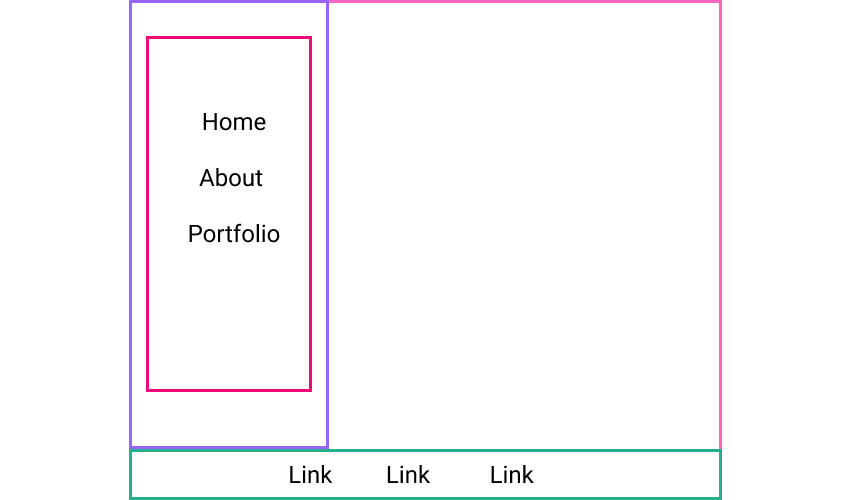

# Personal Portfolio Site

## Introduction

It is common for developers to create a website to show off their web-dev skills and document their work and interests. These sites often feature things like:

- A professional introduction of themselves, careers, and interests
- A portfolio of projects that they've created and/or collaborated on
- A blog to share their experiences, thoughts, and/or subject matter expertise
- Other materials to share any non-coding interests and hobbies
- A site designed to express themselves

We will use HTML & CSS to create a static site whose content is our personal portfolio. Our personal portfolio site should contain information about ourselves and the coding work we've done.

### Some Inspiration
- [http://lizabinante.com/](http://lizabinante.com/)
- [http://where.coraline.codes/](http://where.coraline.codes/)
- [http://danisaurus.github.io/](http://danisaurus.github.io/)
- [http://www.fenslattery.com/](https://fenslattery.com/)
- [https://www.heyellieday.com/](https://heyellieday.com/)
- [http://car.oline.codes/](http://car.oline.codes/)

## Learning Goals:
- Practice creating semantic HTML
- Practice applying visual styles with CSS
- Use both HTML & CSS together to create a comprehensive design

## Project Requirements

### Only Use Static HTML and CSS

We should only use static HTML and CSS for this project. Preprocessors (haml, erb, sass, less, etc.) and Javascript of any kind are not allowed. All submitted HTML needs to pass as valid HTML through an [HTML Validator](https://validator.w3.org/).

## Wave 1 - Basic HTML

This portfolio site must have the following HTML files:

- `index.html` must include your name somewhere.

- `about.html` should include some information about you, your interests, background or similar. Only post what you are comfortable sharing.

- `portfolio.html` must include information about several projects you have completed at Ada (or elsewhere) with links to the GitHub repo (if available), descriptions, images, etc.

### Layout

Each page in this project must comply with the following layout requirements:

- Has the following tags: `<header>`, `<footer>`, and `<nav>`
- Inside of the `<nav>`, there are links to all of the other pages

## Wave 2 - Styling

### Required Content

- Uses at least one CSS file (likely named `style.css`)

## Wave 3 - Layout

### Required Content

Present the elements on the page as you see fit by using the following at least once:
* a grid container with a few grid items
* a flexbox container with a few flex items

Both of these containers do not need to be on the same page. Try using one for one page, and the other for another page!

If you need some inspiration, here are two common layouts you can replicate

  

  

 

### Non-Functional Requirements

The site should follow best practices, including:
  - All markup should be semantic, with consideration of hierarchy and accessibility
  - CSS should be concise and well-formatted
  - Images and stylesheets should be kept in their own folders, called `images` and `stylesheets`, respectively
  - Run your site through an [HTML Validator](https://validator.w3.org/#validate_by_upload) and fix all errors before submitting

### Optional Enhancements

- Create a `blog/` or `code-journal/` directory. Within this directory...
  - create single `html` file for each entry in your blog/journal
  - update the nav on the rest of your site to reference each entry as a sublist/subnav.
  - update any tags with path references (`img`, `link`, `a` tags) to accommodate for the entries being in a different directory.
- Create any number of additional pages or directories.

### A Word of Caution

A lot of developers find their initial foray into CSS frustrating. Every browser implements the CSS standard a little (or a lot) differently. Learning to manipulate elements and understand the _box model_ takes time. Layout can be especially challenging to developers new to CSS. For this project, focus on understanding the mechanics and semantics of HTML and CSS, and how the two work together.

### Optional: Deploy with GitHub Pages
Want more? Make your site live on the internet! There are a lot of ways to go about hosting a live website, but GitHub provides a way to host static sites for free using your GitHub account. [Follow the steps listed here](https://pages.github.com/).
