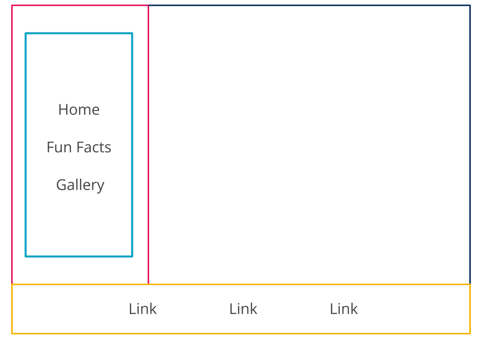
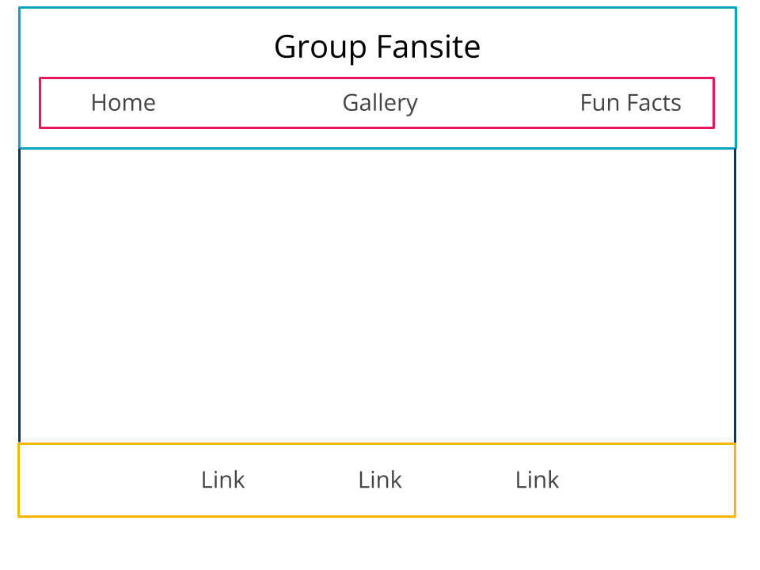

# Group Fansite

## Introduction

When first starting out, it is common for developers to create a small website to show off their web-dev skills and document their interests. 

We will use HTML & CSS to create a static site whose content is a fansite about something your group is passionate about. Your group fansite should contain a home page with some introductory information about your chosen topic, a fun facts page about your topic, and a gallery showcasing pictures about your topic.

### Sample Site
View a simple sample website [here](https://adaanswers.github.io/group-fansite-example/index.html). 

## Learning Goals:
- Practice creating semantic HTML
- Practice applying visual styles with CSS
- Use both HTML & CSS together to create a comprehensive design

## Project Requirements

### Only Use Static HTML and CSS

We should only use static HTML and CSS for this project. Preprocessors (haml, erb, sass, less, etc.) and Javascript of any kind are not allowed. All submitted HTML needs to pass as valid HTML through an [HTML Validator](https://validator.w3.org/).

## Wave 1 - Basic HTML

This group fansite must have the following HTML files:

- `index.html` must include your names or team name somewhere.

- `facts.html` should include a series of fun facts or more detailed information about your topic.

- `gallery.html` must include at least 3 images with descriptions and links to where the images came from if applicable. 

Each group member should take responsibility for creating one HTML file. 

### Layout

Each page in this project must comply with the following layout requirements:

- Has the following tags: `<header>`, `<footer>`, and `<nav>`
- Inside of the `<nav>`, there are links to all of the other pages

## Wave 2 - Styling

### Required Content

In this wave, we will add CSS styling to change the appearance of the site.

Create and use one main CSS document named `style.css`, which will hold styles that apply to every page. Then create three additional CSS documents for each HTML page's specific styles, named `index.css`, `facts.css`, and `gallery.css`.

**Each html page should link to two style sheets:** `style.css` first, and then CSS document that corresponds to it (`index.css`, `facts.css`, or `gallery.css`). This will ensure that the specific styles override the generic one.

Work together as a group to first create generic stylings for all three HTML files in `style.css`. Each group member should also add at least three page specific styles to their page specific style sheet, at least one of which should override the corresponding generic style from `style.css`.

## Wave 3 - Layout

### Required Content

In this wave, work together to present the elements on the page as you see fit by using the following at least once:
* a grid container with a few grid items
* a flexbox container with a few flex items

Both of these containers do not need to be on the same page. Try using one for one page, and the other for another page! 

If you need some inspiration, here are two common layouts you can replicate

  

  

 

### Non-Functional Requirements

The site should follow best practices, including:
  - All markup should be semantic, with consideration of hierarchy and accessibility
  - CSS should be concise and well-formatted
  - Images and stylesheets should be kept in their own folders, called `images` and `stylesheets`, respectively
  - Run your site through an [HTML Validator](https://validator.w3.org/#validate_by_upload) and fix all errors before submitting

### Optional Enhancements

- Create a `blog/` directory. Within this directory...
  - create single `html` file for each entry in your blog/journal
  - update the nav on the rest of your site to reference each entry as a sublist/subnav.
  - update any tags with path references (`img`, `link`, `a` tags) to accommodate for the entries being in a different directory.
- Create any number of additional pages or directories.

### A Word of Caution

A lot of developers find their initial foray into CSS frustrating. Every browser implements the CSS standard a little (or a lot) differently. Learning to manipulate elements and understand the _box model_ takes time. Layout can be especially challenging to developers new to CSS. For this project, focus on understanding the mechanics and semantics of HTML and CSS, and how the two work together.

### Optional: Deploy with GitHub Pages
Want more? Make your site live on the internet! There are a lot of ways to go about hosting a live website, but GitHub provides a way to host static sites for free using your GitHub account. [Follow the steps listed here](https://pages.github.com/).
